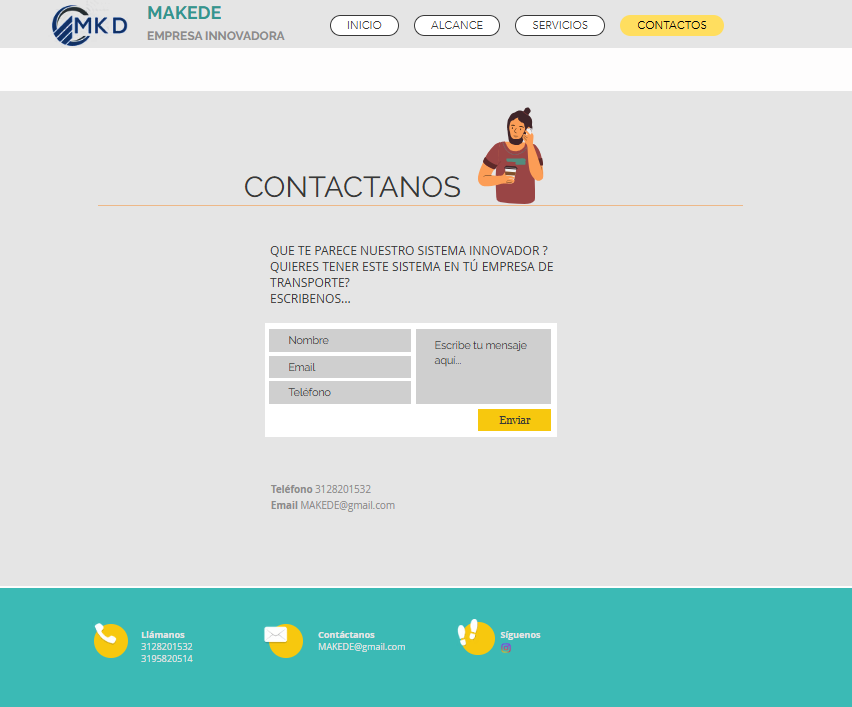
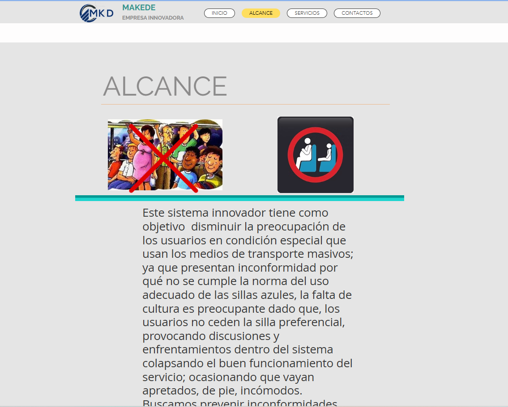

# boton-preferencial
Landing page creada en Wix como solución para mejorar la organización y atención de clientes en negocios con alta demanda, Proyecto  desarrollado en la asignatura de creación de empresa 
### Ver proyecto
https://deyssiesquivia.wixsite.com/botonpreferencial

### Qué demuestra este proyecto
- Diseño de landing pages en Wix  
- Organización de contenido web  
- Enfoque problema → solución  
- Uso de herramientas no-code  

###  Herramientas usadas
- Wix  
- Diseño UX básico  
- Investigación de experiencia de usuario  

### Evidencia visual

### Página de inicio
![página-inicio.png)

### Servicios
![p+agina-servicios.png)

### Contacto

### Alcance del proyecto

---

###Sobre mí
Tengo habilidades en creación de páginas web tipo landing page, organización de proyectos digitales y diseño de soluciones enfocadas en la experiencia del usuario.

---

# creado
Deissy Esther Esquivia Perez 
- Email: (deisyesquivia3@gmail.com)

